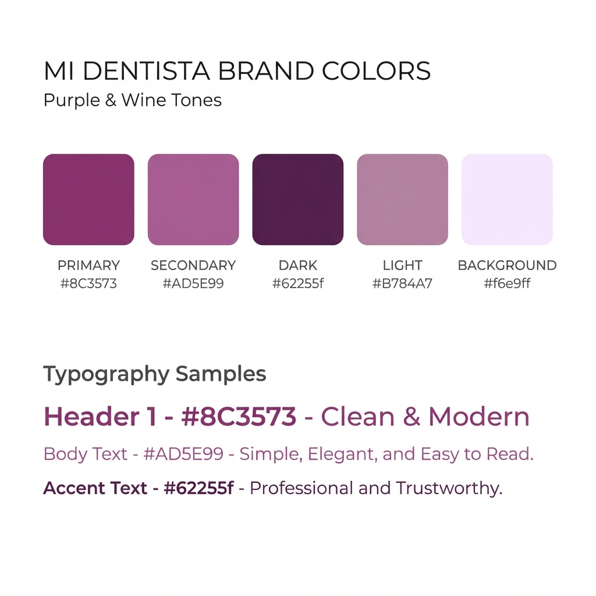

# 🦷 Mi Dentista - Manual de Identidad de Marca y Guía Técnica

> **Versión 1.1** | Enero 2026

## 1. Introducción
Este documento define la identidad visual y verbal de **Mi Dentista**, así como las directrices técnicas para el desarrollo del proyecto. Nuestro objetivo es proyectar confianza, calidez y profesionalismo en cada punto de contacto, asegurando una implementación tecnológica coherente y mantenible.

---

## 2. Esencia de la Marca

### Misión
Ofrecer un cuidado odontológico excepcional centrado en la persona, donde la excelencia técnica se une a un trato profundamente humano, eliminando el miedo al dentista y celebrando la salud de toda la familia.

### Valores Fundamentales
*   **Empatía:** Entendemos y validamos los sentimientos de nuestros pacientes.
*   **Calidez:** Un trato cercano que hace sentir al paciente como en casa.
*   **Excelencia:** 20 años de experiencia respaldan cada tratamiento.
*   **Familia:** Cuidamos sonrisas de todas las generaciones.

---

## 3. Voz y Tono

Nuestra comunicación es el reflejo de nuestro trato en consulta: profesional pero accesible, nunca distante.

*   **Tono:** Cercano, Tranquilizador, Respetuoso, Optimista.
*   **Lenguaje:** Claro, directo, evitando tecnicismos innecesarios o explicándolos con sencillez.
*   **Keywords:** *Sonrisa, Cuidado, Familia, Delicadeza, Confianza, Poble Sec, Barcelona.*

**Ejemplo de Voz:**
> "Expertos en odontología empática y respetuosa. Cuidamos de tu salud buco-dental con delicadeza y mucho cariño."

---

## 4. Identidad Visual

### Logotipo

#### La Idea
El logotipo de **Mi Dentista** es una representación gráfica de la prevención y el cuidado activo. 
Visualmente, se construye mediante un **isotipo lineal** que integra una silueta dental orgánica con la forma simplificada de un cepillo de dientes. Esta fusión simbólica transmite que la salud bucal es un proceso compartido: el diente (el paciente) y el cepillo (la herramienta/el cuidado). Las líneas redondeadas y fluidas eliminan la frialdad médica típica, ofreciendo una imagen amigable, accesible y moderna.

#### Detalles Técnicos
*   **Construcción:** Lineal (Outline style), con trazos de grosor consistente y terminaciones redondeadas (Soft caps/joints).
*   **Tipografía del Logo:** Una fuente sans-serif geométrica, robusta y redondeada. La "M" y la "D" mayúsculas aportan estructura, mientras que las formas curvas de las minúsculas dialogan con el isotipo.
*   **Área de Protección:** Se recomienda un margen de seguridad equivalente al ancho del cepillo alrededor de todo el logotipo.
*   **Legibilidad:** La simplicidad del trazo permite una excelente reducción, manteniendo la identidad clara incluso en tamaños de favicon o avatares móviles.

#### Variaciones de Color
Para mantener la coherencia visual en todos los medios, hemos definido tres variaciones oficiales:

> **Nota:** La siguiente imagen muestra la versión **Original** del logotipo. Las variaciones Negativa y Custom se describen a continuación y deben derivarse vectorialmente de este archivo maestro.


1.  **Original (Positive):**
    *   *Descripción:* Icono y texto completamente en **Brand Dark / Deep Purple (#62255f)** sobre fondo **Blanco**.
    *   *Uso Principal:* Cabeceras de documentos, sitio web (modo claro), papelería oficial. Transmite limpieza y profesionalidad máxima.

2.  **Negativo (White):**
    *   *Descripción:* Icono y texto en **Blanco** puro sobre fondo **Brand Dark / Deep Purple (#62255f)**.
    *   *Uso Principal:* Versión para fondos oscuros, pies de página (footer) de la web, tarjetas de visita (reverso) o señalética contrastada.

3.  **Custom / Soft Variant:**
    *   *Descripción:* Icono en **Brand Light / Soft Lavender (#B784A7)** y Texto en **Brand Dark (#62255f)**, sobre un fondo **Brand Background / Pale Lavender (#f6e9ff)**.
    *   *Uso Principal:* Redes sociales, banners promocionales suaves, materiales de marketing donde se busca evocar calma, dulzura y empatía. Esta variante humaniza la marca.

### Paleta de Colores
Nuestra paleta se basa en tonos púrpuras y vinos que evocan elegancia, creatividad y calma, diferenciándonos del típico "azul clínico".



#### Colores Principales

| Color | Nombre | Hex | Uso |
| :--- | :--- | :--- | :--- |
| **Brand Primary** | `#8C3573` | Botones principales, encabezados destacados, iconos activos. Es el corazón de la marca. |
| **Brand Secondary** | `#AD5E99` | Elementos secundarios, hovers, acentos sutiles. |
| **Brand Dark** | `#62255f` | Fondos oscuros, texto de alto contraste sobre fondos claros, pie de página. |

#### Colores de Soporte

| Color | Nombre | Hex | Uso |
| :--- | :--- | :--- | :--- |
| **Brand Light** | `#B784A7` | Bordes suaves, fondos de tarjetas secundarias, detalles decorativos. |
| **Brand Background** | `#f6e9ff` | Fondos de secciones alternas, garantiza legibilidad y frescura. |
| **Brand White** | `#edd2ff` | Variación suave del blanco para textos sobre fondos oscuros o elementos sutiles. |

---

### Tipografía

#### Títulos y Cuerpo: **Montserrat** / **Barlow**
Fuentes sans-serif limpias, modernas y altamente legibles.
*   **Montserrat**: Se utiliza principalmente para títulos y elementos de UI que requieren geometría y claridad.
*   **Barlow**: Complementaria, ideal para textos con necesidades técnicas o densas.
*   *Nota: La tipografía "Unbounded" ha sido discontinuada y no debe utilizarse en nuevos diseños.*

---

## 5. Guía Técnica para Desarrolladores

### Tech Stack
Este proyecto está construido con herramientas modernas para asegurar rendimiento, escalabilidad y una excelente experiencia de desarrollador.

*   **Runtime/Package Manager:** Bun / npm
*   **Framework:** React (Vite)
*   **Lenguaje:** TypeScript
*   **Estilos:** TailwindCSS + CSS Modules (para casos específicos)
*   **Iconos:** Lucide React
*   **Animaciones:** Tailwind Animate
*   **Componentes UI:** Shadcn/ui (basado en Radix UI)

### Estructura del Proyecto

```
/src
  /assets        # Imágenes, iconos y recursos estáticos
  /components    # Componentes React reutilizables
    /ui          # Componentes base (botones, inputs, etc.)
  /data          # Datos estáticos (ej. lista de servicios, testimonios)
  /hooks         # Custom React Hooks
  /lib           # Utilidades y configuración de librerías (ej. utils.ts)
  /pages         # Componentes de página (Vistas completas)
```

### Configuración de Estilos
Los colores y fuentes de la marca están configurados en `tailwind.config.ts`.
*   Para usar el color primario: `text-brand-primary`, `bg-brand-primary`
*   Para usar el color de fondo: `bg-brand-bg`
*   Fuentes: `font-montserrat`, `font-barlow`

### Comandos Clave

*   `npm run dev`: Inicia el servidor de desarrollo local.
*   `npm run build`: Compila el proyecto para producción.
*   `npm run preview`: Vista previa local de la build de producción.
*   `npm run lint`: Ejecuta el linter para asegurar calidad de código.

### Buenas Prácticas
1.  **Componentes Pequeños:** Divide la UI en componentes pequeños y reutilizables.
2.  **Tipado Estricto:** Usa TypeScript para definir interfaces claras para tus props y datos.
3.  **Mobile First:** Diseña y desarrolla pensando primero en dispositivos móviles y luego escala a escritorio usando los prefijos `md:`, `lg:`.
4.  **Semántica:** Usa etiquetas HTML semánticas (`<section>`, `<article>`, `<nav>`) para mejorar accesibilidad y SEO.

